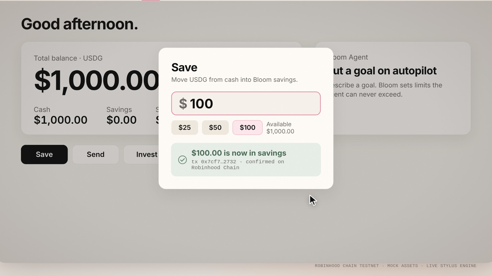
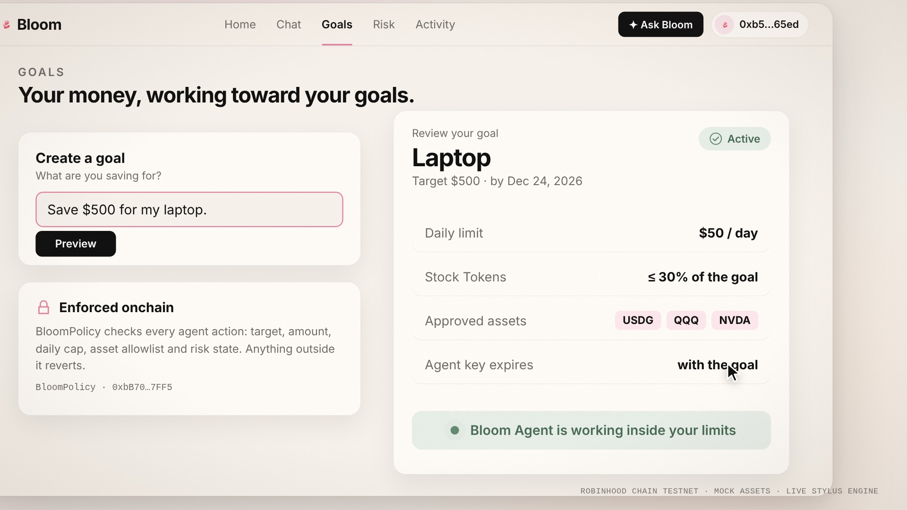
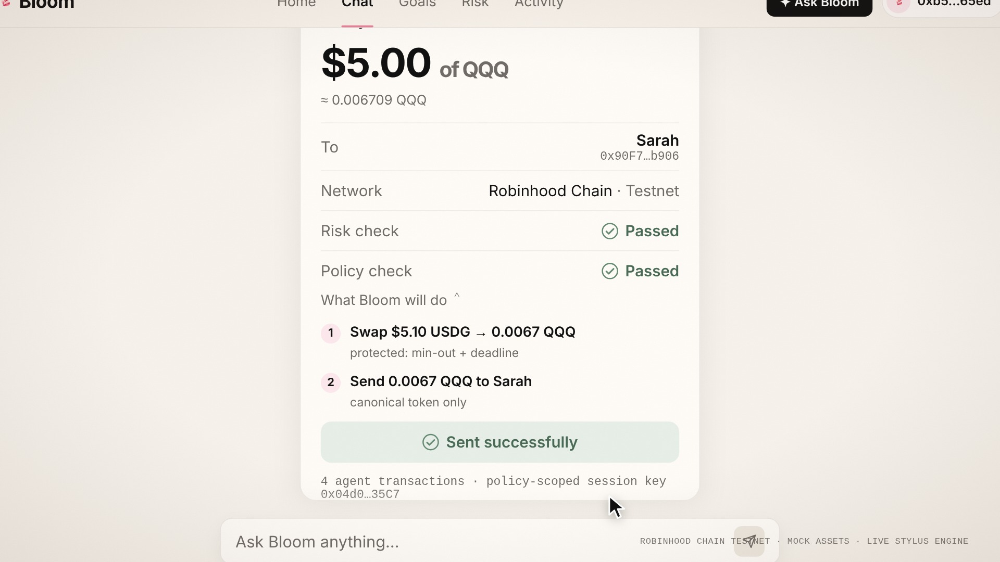
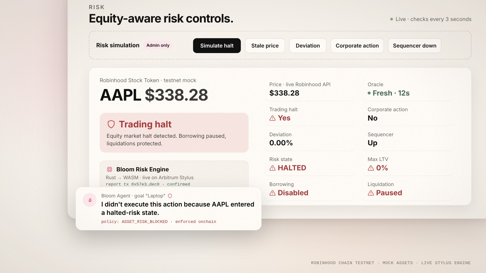
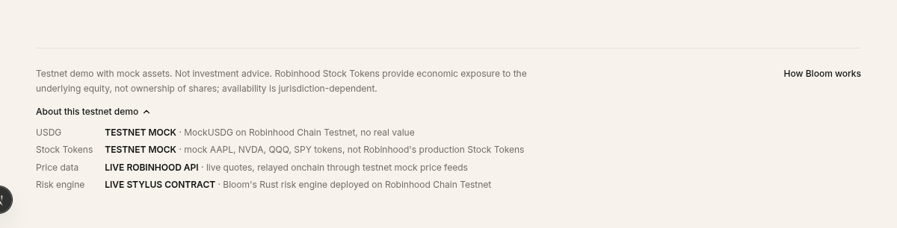
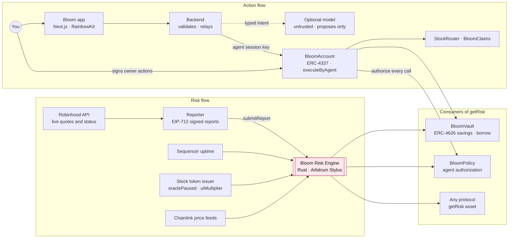
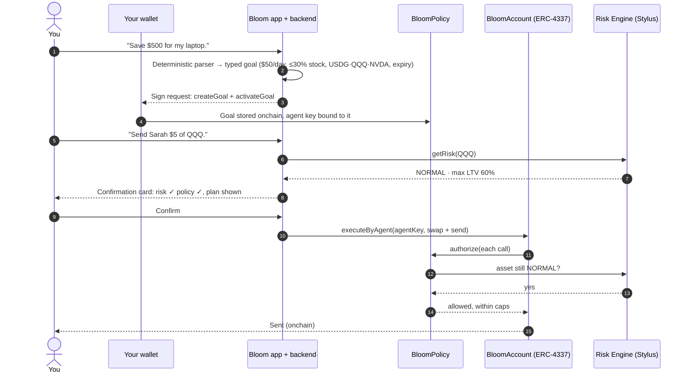
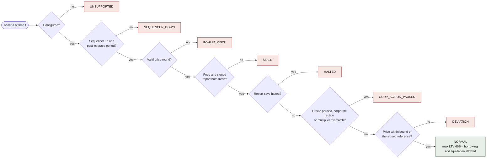
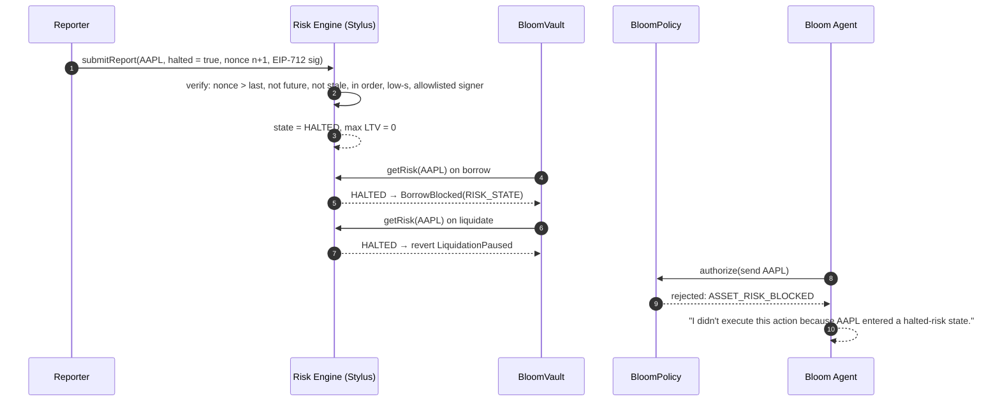

<p align="center">
  
</p>

<h1 align="center">
  <br>
  Bloom
</h1>

<h3 align="center">The wallet where dollars become assets <i>and actions.</i></h3>

<p align="center">
  Save in USDG · Send Robinhood Stock Tokens · Let an AI agent act, but only inside rules the chain enforces.<br>
  Powered by an equity-aware risk engine written in Rust and running live on <b>Arbitrum Stylus</b>.
</p>

<p align="center">
  
  
  
  
  
  
</p>

<p align="center">
  <b>Arbitrum Open House Singapore · Online Buildathon 2026</b>
</p>

---

## Quick links

| | |
| --- | --- |
| **Live app** | _add the Vercel URL here_ |
| **Demo video (2:24)** | _add the YouTube URL here_ |
| **Whitepaper (14 pages)** | [`docs/Bloom-Whitepaper.pdf`](docs/Bloom-Whitepaper.pdf) |
| **Live API** | [`bloom-backend-x604.onrender.com/api/health`](https://bloom-backend-x604.onrender.com/api/health) |
| **Stylus risk engine** | [`0xc464…b124` on the explorer](https://explorer.testnet.chain.robinhood.com/address/0xc464c03bfe7efa388457b8b392454b99fa18b124) |
| **All contract addresses** | [Deployed contracts](#deployed-contracts) · [`deployments/robinhood-testnet.json`](deployments/robinhood-testnet.json) |
| **Docs** | [Architecture](ARCHITECTURE.md) · [Security](SECURITY.md) · [Deployment](DEPLOYMENT.md) · [API](docs/API.md) · [MetaMask QA](docs/METAMASK_QA.md) |

## At a glance

| | |
| --- | --- |
| **What it is** | A consumer wallet on Robinhood Chain for USDG savings, Stock Token sends and goal-based AI automation |
| **The core idea** | *A price is not a permission.* Borrowing, liquidation and agent actions are gated by a risk engine that understands halts, corporate actions, staleness and deviation |
| **What is live** | 12 contracts plus mock assets on Robinhood Chain Testnet, the Stylus risk engine, a halt-aware reporter fed by the live Robinhood API, a hosted API and the full web app |
| **Proof** | 139 Hardhat · 11 Foundry fuzz/invariant · 16 Stylus Rust · 9 reporter · 22 backend tests; 13/13 end-to-end checks against the live testnet |

---

## Table of contents

1. [Introduction](#1-introduction)
2. [The problem](#2-the-problem)
3. [The solution](#3-the-solution)
4. [What makes Bloom different](#4-what-makes-bloom-different)
5. [Product tour](#5-product-tour)
6. [Architecture and workflows](#6-architecture-and-workflows)
7. [Market](#7-market)
8. [Business model and roadmap](#8-business-model-and-roadmap)
9. [Measured results](#9-measured-results)
10. [Deployed contracts](#deployed-contracts)
11. [Getting started](#11-getting-started)
12. [Repository map and tech stack](#12-repository-map-and-tech-stack)
13. [Security and known limitations](#13-security-and-known-limitations)
14. [License and attribution](#14-license-and-attribution)

---

## 1. Introduction

Robinhood is bringing US equities onchain. On **July 1, 2026** it announced that Robinhood Chain, built on the Arbitrum
platform, is live, with Stock Tokens available in the Robinhood Wallet in **more than 120 countries**, and that
**Agentic Accounts** would let people connect an AI model to their account while humans "set the specific safety
guardrails" ([Robinhood newsroom](https://robinhood.com/us/en/newsroom/robinhood-accelerates-global-expansion-robinhood-chain-mainnet-stock-tokens-agentic-trading/)).

That creates two new kinds of money: dollars (USDG) and stock tokens that move 24/7, and agents that move them. Bloom is
the wallet built for both. It is three screens, **Home, Chat and Goals**, on top of four onchain systems: an ERC-4626
savings vault, a canonical-only stock router with claim links, ERC-4337 smart accounts with policy-scoped agent keys,
and the **Bloom Risk Engine**, a default-deny state machine for equity risk running as an Arbitrum Stylus contract.

## 2. The problem

### Tokenized stocks trade around the clock. The stock market does not.

Robinhood's own documentation says end users can trade Stock Tokens onchain outside the window in which market makers
mint and burn them, that corporate actions are applied through an onchain `uiMultiplier`, and that tradability varies
per session ([Robinhood Chain docs](https://docs.robinhood.com/chain/stock-tokens/)). So the token keeps moving while
the underlying market can be:

| Event | What happens to the stock | What a plain price feed sees |
| --- | --- | --- |
| **Trading halt** | The exchange stops trading | A normal-looking last price |
| **Split or corporate action** | Price and shares-per-token re-base; the oracle may pause | A sudden jump, or a frozen value |
| **After hours** | No regular-session trading for most of the day | A price that is hours old |
| **Oracle divergence** | The feed drifts from the real market | One confident, wrong number |

A lending market that treats a fresh price as permission to lend keeps lending and liquidating straight through all of
it. **Lending against stock tokens today is flying blind.**

### AI agents are getting wallets, guarded by a prompt

Agents that turn "save for my laptop" into transactions are arriving now. In most systems the only thing between the
model and the money is a system prompt: injectable, nondeterministic and confident when wrong. In finance the failure
mode is not a bad answer. It is a transfer.

### USDG needs everyday use

Stable dollars on a new chain need real consumer jobs: saving, sending, investing, paying someone new. Not just vault
deposits.

## 3. The solution

<table>
<tr>
<td width="33%" valign="top">

**Wallet**<br>
Save in USDG into an ERC-4626 vault, send Robinhood Stock Tokens, invest in one tap, and pay anyone with a claim link.
Every owner action is signed by the user's own wallet; the backend never holds user keys.

</td>
<td width="33%" valign="top">

**Goal-bound AI agent**<br>
"Save $500 for my laptop" becomes an **onchain policy**: $50/day, at most 30% in Stock Tokens, only approved assets,
expiry built in. The agent acts through a scoped ERC-4337 session key that can never exceed it.

</td>
<td width="33%" valign="top">

**Stylus risk engine**<br>
A Rust/WASM contract that reads the Chainlink price plus **EIP-712 signed Robinhood market reports** and returns one
answer per asset: risk state, max LTV, whether borrowing and liquidation are allowed.

</td>
</tr>
</table>

> **The AI proposes. Your policy decides. The chain enforces.**
>
> Bloom doesn't replace the price oracle. It adds equity-specific risk interpretation around it.

## 4. What makes Bloom different

| | Price-feed lending | Prompt-guarded agents | **Bloom** |
| --- | --- | --- | --- |
| Sees trading halts | No | No | **Yes**: signed market reports |
| Handles splits and corporate actions | No | No | **Yes**: oracle pause, report flag and multiplier checks |
| Knows a price is stale | Heartbeat only | No | **Yes**: feed heartbeat *and* report age |
| Blocks liquidations on bad data | No | n/a | **Yes**: protected mode reverts liquidation if any collateral isn't NORMAL |
| Agent limits | n/a | A prompt | **Onchain policy**: closed call set, caps, allowlist, expiry |
| Survives a compromised server | n/a | No | **Yes**: enforcement lives in contracts, not in the app |
| Reusable by other protocols | No | No | **Yes**: one call, `getRisk(asset)` |

Five properties hold by construction (proofs in the [whitepaper](docs/Bloom-Whitepaper.pdf), §5):

1. **Default deny.** An asset is NORMAL only if all seven adverse predicates are false. Anything missing, malformed,
   stale or contradictory denies.
2. **Adverse monotonicity.** No additional signal can move an asset *into* NORMAL.
3. **Silence denies.** If the reporter, feed or sequencer goes quiet, the asset becomes STALE and its max LTV drops to 0.
4. **Portfolio default deny.** One non-NORMAL collateral asset zeroes the whole position's borrow capacity.
5. **Protected liquidation.** Nobody is liquidated on a halted, stale, deviating or corporate-action price.

And one honest result nobody else will show you: **Stylus costs more gas than the EVM for this workload** (1.57× to
ingest a report, 1.95× to evaluate risk), because the engine is call-bound rather than compute-bound. We measured it,
explain it, and keep Stylus for the memory-safe, natively tested Rust core ([§9](#9-measured-results)).

## 5. Product tour

| Save $100 in USDG | "Save $500 for my laptop." |
| --- | --- |
|  |  |
| One tap into the savings vault; the user's wallet signs. | The sentence becomes an onchain policy; the user signs once and the agent is active. |

| "Send Sarah $5 of QQQ." | Live halt: borrowing stops |
| --- | --- |
|  |  |
| Risk check, policy check, a plain-English plan, then the agent executes onchain. | A signed report lands on the Stylus engine; AAPL flips to HALTED, LTV 0%, and the agent refuses. |

<sub>The four frames above come from the product film, which rebuilds the app's UI with its exact design tokens. The
screenshots below are captures of the running app.</sub>

| Landing | Home | Chat | Risk: halted |
| --- | --- | --- | --- |
|  |  |  |  |

<p align="center"></p>

Mobile (390px): [home](docs/screenshots/home-mobile.png) · [chat](docs/screenshots/chat-mobile.png) · [goals](docs/screenshots/agent-mobile.png) · [risk](docs/screenshots/risk-mobile.png) · [activity](docs/screenshots/activity-mobile.png) · [claim](docs/screenshots/claim-mobile.png)

## 6. Architecture and workflows

### System architecture



### Workflow: from a sentence to an agent action



### The risk lattice: ordered checks, first failure wins, default deny



Every red state returns **max LTV 0%**, disables borrowing and pauses liquidations. Facts about the data are checked
before facts about the market, so a market signal is never read from untrustworthy data.

### Workflow: a live trading halt



More detail: [ARCHITECTURE.md](ARCHITECTURE.md), and the formal model in the [whitepaper](docs/Bloom-Whitepaper.pdf).

## 7. Market

Every figure below is quoted from its source; none is a Bloom estimate.

| Metric | Value | Source |
| --- | --- | --- |
| Tokenized real-world assets, total market cap | **$19.3B** at the end of Q1 2026, up **256.7%** from $5.42B at the start of 2025 | [CoinGecko RWA Report 2026](https://www.coingecko.com/research/publications/rwa-report-2026) |
| Tokenized stocks, market cap | **$486.69M** on Mar 31, 2026, up from **$2.09M** on Jun 30, 2025 (about **233×** in nine months) | [CoinGecko RWA Report 2026](https://www.coingecko.com/research/publications/rwa-report-2026) |
| Largest tokenized stocks | Circle $171.39M (35.2%), Tesla $61.70M (12.7%), Nvidia $42.59M (8.8%) | [CoinGecko RWA Report 2026](https://www.coingecko.com/research/publications/rwa-report-2026) |
| Robinhood Chain | Mainnet live Jul 1, 2026, built on the Arbitrum platform; Stock Tokens in the Robinhood Wallet in 120+ countries | [Robinhood newsroom](https://robinhood.com/us/en/newsroom/robinhood-accelerates-global-expansion-robinhood-chain-mainnet-stock-tokens-agentic-trading/) |
| Agentic finance | Robinhood Agentic Accounts: users connect their AI model of choice; "humans remain in control by deciding exactly how much capital to allocate and set the specific safety guardrails" | [Robinhood newsroom](https://robinhood.com/us/en/newsroom/robinhood-accelerates-global-expansion-robinhood-chain-mainnet-stock-tokens-agentic-trading/) |
| Stock Token mechanics | Every Stock Token has a live Chainlink feed; corporate actions apply through an onchain `uiMultiplier`; tradability varies per session | [Robinhood Chain docs](https://docs.robinhood.com/chain/stock-tokens/) |

**Why now.** Tokenized stocks are the fastest-growing slice of the RWA market, the largest US retail broker has put
them onchain on an Arbitrum chain, and the same company is handing wallets to AI agents with human-set guardrails.
Every lending market, agent and wallet built on top of that needs to know *whether it is safe to act on a stock token
right now*, and to enforce the guardrails somewhere a model can't talk its way past. Bloom is the consumer app and the
risk primitive for that world.

**Who uses what.**

| Customer | What they use | Why |
| --- | --- | --- |
| Retail users | The Bloom wallet | Save in USDG, send stock tokens, automate goals safely |
| Lending protocols and money markets | `getRisk(asset)` | Stop lending and liquidating through halts and corporate actions |
| Agent and wallet builders | BloomPolicy + BloomAccount pattern | Give agents real limits the chain enforces |
| Structured-product and vault builders | Risk states as a gate | Pause strategies automatically on market events |

## 8. Business model and roadmap

> Planned, not implemented. Nothing below is live today.

| Revenue line | How it would work |
| --- | --- |
| Savings spread | A small share of vault yield, disclosed in-app |
| Swap and send fees | A transparent fee on Stock Token swaps routed through the StockRouter |
| Risk-engine access for protocols | Free `getRisk` reads onchain; paid SLAs, dedicated reporters and data coverage for institutional integrators |
| Premium agent goals | Advanced automation (rebalancing, recurring investing) inside the same onchain policy model |

| Stage | Milestones |
| --- | --- |
| **Now: testnet release candidate** | Live Stylus engine, full app, 197 tests, 13/13 live E2E, hosting configs |
| **Next** | k-of-n reporter quorum, guardian agent denylist, Stylus source verification, external audit, ERC-1271 sign-in |
| **Mainnet** | Canonical USDG and Stock Tokens with Chainlink stock feeds (the gated deploy script already supports this), an interest-rate model, the USDG/USD feed |
| **Scale** | `getRisk` integrations with lending protocols on Robinhood Chain, more assets, mobile |

## 9. Measured results

All measured on September 25, 2026 at tag `bloom-v2-rc1` (details and methods in the [whitepaper](docs/Bloom-Whitepaper.pdf), §10).

| Suite | Result |
| --- | --- |
| Hardhat (engine vectors onchain, vault, router, claims, policy, account, ERC-4337, role separation, demo flow) | **139 / 139** |
| Foundry (property fuzzing at 1,000 runs per property, vault invariants at 128 runs × depth 64) | **11 / 11** |
| Stylus Rust (43 shared spec vectors, EIP-712 parity, contract tests) | **16 / 16** |
| Reporter | **9 / 9** |
| Backend (intents, sign-in and replay, authorization matrix, rate limits, CORS, key separation) | **22 / 22** |
| End-to-end demo against the **live testnet** | **13 / 13** |
| Wallet flow against the **live testnet** (a fresh wallet signs every owner action) | **7 / 7** |
| Frontend | `tsc`, `eslint`, `next build` clean |

**Stylus versus EVM, measured** with [`scripts/bench-risk-engine.js`](scripts/bench-risk-engine.js) (sends no transactions):

| Operation | EVM twin | Stylus | Ratio |
| --- | --- | --- | --- |
| `submitReport`, steady state (execution gas) | 100,811 | 158,613 (median of 12 live receipts) | 1.57× |
| `getRisk` (execution gas) | ≈ 55,500 | ≈ 108,200 | 1.95× |
| Runtime code size | 8,931 B | 32,795 B compressed | 3.67× |

**Live reporter cycle.** One cycle advanced every asset's report nonce by exactly one (AAPL 70→71, NVDA 64→65,
QQQ 69→70, SPY 65→66); the AAPL report (tx `0x57e3…dec0`) carried $336.31 while the Robinhood API quoted a bid of $336.14
and an ask of $336.26. Running cost at a 120-second cycle over four assets: about 0.005 testnet ETH per day.

<a id="deployed-contracts"></a>
## 10. Deployed contracts

**Live on Robinhood Chain Testnet (chain 46630)**, deployed 2026-09-25, with the risk engine running as a real
**Arbitrum Stylus (Rust/WASM) contract**. Manifest: [`deployments/robinhood-testnet.json`](deployments/robinhood-testnet.json).
Integrity is checkable read-only with `npx hardhat run scripts/verify-deployment.js --network robinhoodTestnet`.

| Contract | Address |
| --- | --- |
| **BloomRiskEngine (Stylus)** | [`0xc464c03bfe7efa388457b8b392454b99fa18b124`](https://explorer.testnet.chain.robinhood.com/address/0xc464c03bfe7efa388457b8b392454b99fa18b124) |
| BloomVault | [`0x74b4413B3f8433Ec62469Edd03099a4CFE87fFD8`](https://explorer.testnet.chain.robinhood.com/address/0x74b4413B3f8433Ec62469Edd03099a4CFE87fFD8) |
| BloomPolicy | [`0xbB70407361baEE36cf6d904585D0332f3bc07FF5`](https://explorer.testnet.chain.robinhood.com/address/0xbB70407361baEE36cf6d904585D0332f3bc07FF5) |
| BloomAccountFactory | [`0xca8e103387c15476De7EB190B9f20c8E2c86510A`](https://explorer.testnet.chain.robinhood.com/address/0xca8e103387c15476De7EB190B9f20c8E2c86510A) |
| StockRouter | [`0xCE57171cAF60C59cB4bAe61f5580A53F59433A0c`](https://explorer.testnet.chain.robinhood.com/address/0xCE57171cAF60C59cB4bAe61f5580A53F59433A0c) |
| BloomClaims | [`0x03E75b560021A99BB7DB13A7a9C8e884268AA844`](https://explorer.testnet.chain.robinhood.com/address/0x03E75b560021A99BB7DB13A7a9C8e884268AA844) |
| BloomAssetRegistry | [`0xa850F501b37420000C16Af1B589c67869Cb287c7`](https://explorer.testnet.chain.robinhood.com/address/0xa850F501b37420000C16Af1B589c67869Cb287c7) |
| EntryPoint v0.8 | [`0x4337084D9E255Ff0702461CF8895CE9E3b5Ff108`](https://explorer.testnet.chain.robinhood.com/address/0x4337084D9E255Ff0702461CF8895CE9E3b5Ff108) |
| MockUSDG (testnet mock) | [`0x44EE1b04e58d7e156630eecafE3447Fcb2bA73E9`](https://explorer.testnet.chain.robinhood.com/address/0x44EE1b04e58d7e156630eecafE3447Fcb2bA73E9) |
| MockSequencerUptimeFeed | [`0x251EB53886FF648320050fb4Be7357459f99460e`](https://explorer.testnet.chain.robinhood.com/address/0x251EB53886FF648320050fb4Be7357459f99460e) |
| MockLendingAdapter | [`0xaC003B28FE2da20422fBbFCef70cdFB562C922C7`](https://explorer.testnet.chain.robinhood.com/address/0xaC003B28FE2da20422fBbFCef70cdFB562C922C7) |
| MockSwapVenue | [`0x1a895320723619D2E3F395ceca27D210A7e59ED3`](https://explorer.testnet.chain.robinhood.com/address/0x1a895320723619D2E3F395ceca27D210A7e59ED3) |
| AAPL (testnet mock) | [`0x707B9aDC0fc8F656bcc1E9160C6eaEa4A8966Dc3`](https://explorer.testnet.chain.robinhood.com/address/0x707B9aDC0fc8F656bcc1E9160C6eaEa4A8966Dc3) |
| NVDA (testnet mock) | [`0xbE552A9Bd5389518c6EB3FB97bF7064F43226ce9`](https://explorer.testnet.chain.robinhood.com/address/0xbE552A9Bd5389518c6EB3FB97bF7064F43226ce9) |
| QQQ (testnet mock) | [`0x4F7141763FeB5dB91178343d3c894E88992794A3`](https://explorer.testnet.chain.robinhood.com/address/0x4F7141763FeB5dB91178343d3c894E88992794A3) |
| SPY (testnet mock) | [`0x2AF710af85914DEe0AA89017223638367645f6b4`](https://explorer.testnet.chain.robinhood.com/address/0x2AF710af85914DEe0AA89017223638367645f6b4) |

Canonical mainnet dependencies Bloom is configured for (mainnet not deployed; the gated script refuses above its cost limit):

| Asset | Address | Chainlink feed |
| --- | --- | --- |
| USDG | `0x5fc5360D0400a0Fd4f2af552ADD042D716F1d168` | USDG/USD `0x61B7e5650328764B076A108EFF5fa7282a1B9aD2` |
| AAPL | `0xaF3D76f1834A1d425780943C99Ea8A608f8a93f9` | `0x6B22A786bAa607d76728168703a39Ea9C99f2cD0` |
| NVDA | `0xd0601CE157Db5bdC3162BbaC2a2C8aF5320D9EEC` | `0x379EC4f7C378F34a1B47E4F3cbeBCbAC3E8E9F15` |
| QQQ | `0xD5f3879160bc7c32ebb4dC785F8a4F505888de68` | `0x80901d846d5D7B030F26B480776EE3b29374C2ae` |
| SPY | `0x117cc2133c37B721F49dE2A7a74833232B3B4C0C` | `0x319724394D3A0e3669269846abE664Cd621f9f6A` |
| EntryPoint v0.8 | `0x4337084D9E255Ff0702461CF8895CE9E3b5Ff108` | — |

## 11. Getting started

**Use the live testnet app.** Open the app, press **Try Bloom**, connect a wallet with a little Robinhood Chain testnet
ETH, and sign the one-time EIP-712 sign-in message (no gas). Then: *Get test USDG → Save $100 → "Save $500 for my
laptop." → "Send Sarah $5 of QQQ." → Risk*. The full checklist is in [docs/METAMASK_QA.md](docs/METAMASK_QA.md).

**Run it locally (Hardhat chain):**

```bash
npm install && npx hardhat node                    # terminal 1
npm run deploy:local                               # terminal 2
cd backend && npm install && npm start             # terminal 3 (API + halt-aware reporter)
cd frontend && npm install && npm run dev          # terminal 4 → http://localhost:3000
```

**Run against the live testnet:**

```bash
node scripts/generate-role-keys.js                                   # one key per role in .env.local (never commit it)
BLOOM_DEPLOYMENT=robinhood-testnet npm --prefix backend start
npm --prefix frontend run dev
```

**Test everything:**

```bash
npm test                  # Hardhat
npm run test:fuzz         # Foundry
npm run test:stylus       # Stylus (Rust)
npm --prefix offchain/reporter test && npm --prefix backend test
npm --prefix backend run smoke                                           # end-to-end demo against a running backend
BLOOM_DEPLOYMENT=robinhood-testnet node backend/scripts/wallet-flow-smoke.ts   # a fresh wallet signs every owner action
npx hardhat run scripts/bench-risk-engine.js                              # Stylus vs EVM gas
```

**Deploy and host:** Vercel for the frontend and Render or Railway for the backend; step-by-step instructions and
every environment variable are in [DEPLOYMENT.md](DEPLOYMENT.md) (§6).

## 12. Repository map and tech stack

```
contracts/            Solidity: BloomVault, BloomPolicy, BloomAccount(+Factory), StockRouter, BloomClaims, registry, EVM risk twin
stylus-risk-engine/   Rust: the Bloom Risk Engine for Arbitrum Stylus (pure classifier + EIP-712, natively unit-tested)
offchain/reporter/    Halt-aware reporter: Robinhood API → EIP-712 market reports → risk engine
backend/              TypeScript API: EIP-712 sign-in, intents, agent relay, claims, faucet, rate limits, audit log
frontend/             Next.js + RainbowKit app: landing, Home, Chat, Goals, Risk, Activity, claim links
test/                 Hardhat tests, Foundry fuzz/invariants, shared risk vectors (test/vectors/risk-vectors.json)
scripts/              Deploy, role handover and rotation, integrity check, mainnet preflight, gas benchmark
docs/                 Whitepaper, API, MetaMask QA, screenshots
video/                The product film (Remotion), narration and score sources
```

| Layer | Stack |
| --- | --- |
| Risk engine | Rust 1.91 · stylus-sdk 0.10.6 · cargo-stylus 0.10.9 · Arbitrum Stylus |
| Contracts | Solidity 0.8.28 (viaIR, Cancun) · OpenZeppelin 5 · Hardhat · Foundry |
| Accounts | ERC-4337 v0.8 smart accounts with policy-scoped session keys |
| Backend and reporter | Node · TypeScript · Express 5 · ethers v6 · zod |
| Frontend | Next.js 16 · React 19 · Tailwind 4 · RainbowKit · wagmi · viem · framer-motion |
| Hosting | Docker · Render / Railway (backend) · Vercel (frontend) |

## 13. Security and known limitations

Security model, trust assumptions, the authority analysis and a threat table mapped to tests: [SECURITY.md](SECURITY.md)
and the [whitepaper](docs/Bloom-Whitepaper.pdf) (§7, §12). Highlights: EIP-712 wallet sign-in, a session-derived wallet
on every call, one key per role (the service refuses to start on reuse), `Ownable2Step` for multisig handover, and an
agent that can only act inside its onchain policy.

Known limitations, stated plainly:

- **Not audited.** This is a testnet release candidate.
- **Testnet assets are mocks.** USDG, the four Stock Tokens and their feeds are testnet mocks relaying live Robinhood API
  quotes; the risk engine and every enforcement contract are real. Robinhood Chain testnet has no canonical USDG,
  Stock Tokens or Chainlink stock feeds.
- **A single reporter key** is trusted for market status (bounded by the price, freshness, deviation, token and
  sequencer checks). A k-of-n quorum is next.
- **No admin-side agent revocation.** One testnet goal (#1), created before key rotation by a throwaway wallet, still
  names the retired key; exposure is at most $50/day of mock USDG until 2026-12-15.
- **Stylus costs more gas here** (measured above), and its source is not yet verified on the explorer.
- Borrowing is interest-free and USDG is valued at $1 in the prototype; Robinhood Chain has no official sequencer uptime
  feed; sessions and rate limits are single-instance; sign-in supports EOAs only (no ERC-1271).

## 14. License and attribution

MIT. See [LICENSE](LICENSE). Bloom evolved from the **Aura** codebase: its smart-account, vault and
Stylus foundations were reused and hardened, and the original sources are archived in
[`legacy/aura/`](legacy/aura/) with attribution preserved. Account abstraction builds on
eth-infinitism's ERC-4337 contracts, and the token and access-control primitives come from OpenZeppelin.

## Disclaimer

Bloom is an experimental prototype for a hackathon and is not investment advice. Robinhood Stock Tokens
are tokenised debt securities that give economic exposure to underlying assets. They don't confer legal
or beneficial ownership of shares, and their availability depends on jurisdiction. Bloom makes no claim
of regulatory approval. It uses existing regulated stablecoin rails (USDG) and is not an issuer. There is
no guaranteed yield or return. Learning rewards are sponsored and can end at any time. The testnet deployment
uses mock assets.
