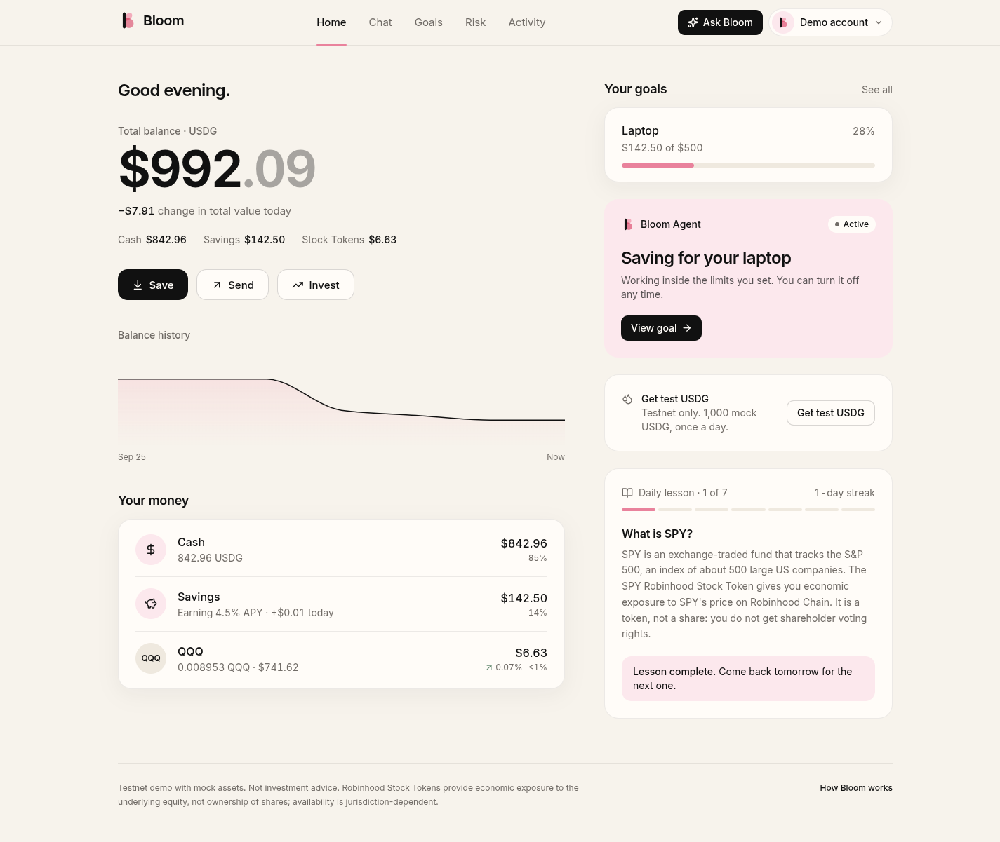
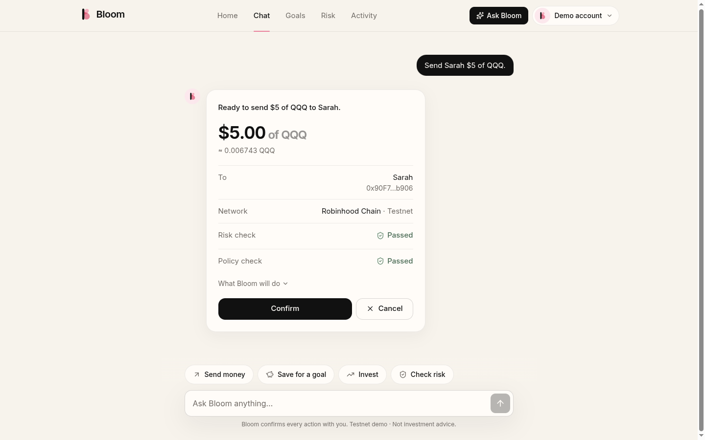
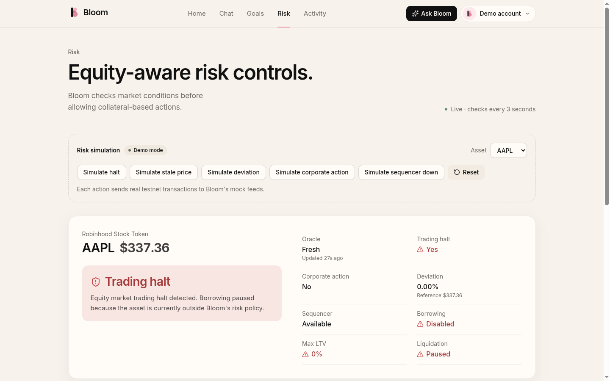
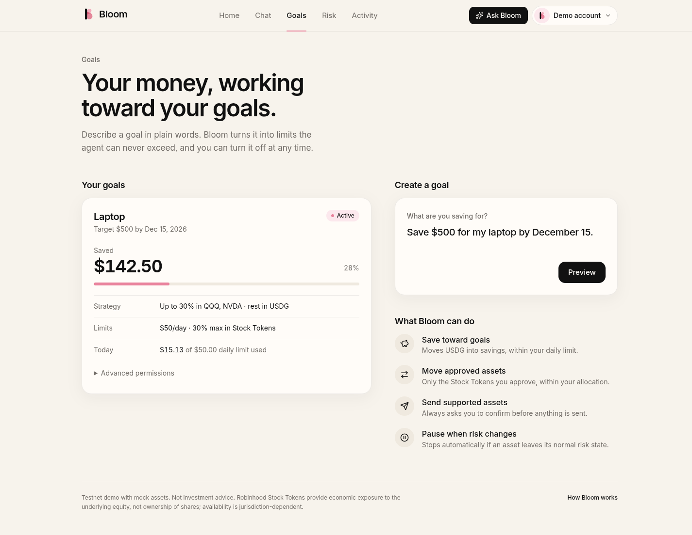
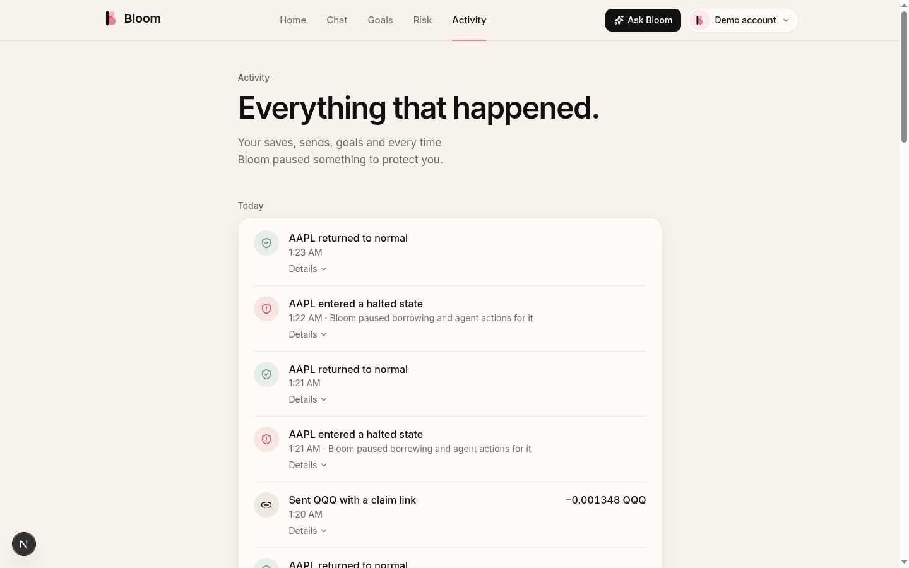

# Bloom

### The wallet where dollars become assets and actions.

> Save in USDG. Send Robinhood Stock Tokens. Let your agent act under your rules.

Consumer finance on Robinhood Chain powered by a Stylus-based equity risk engine.
Built for the **Arbitrum Open House Singapore: Online Buildathon 2026**.

**Bloom is a consumer wallet on Robinhood Chain. Users save in USDG, use supported Robinhood Stock Tokens
as programmable assets, and let an AI agent act under explicit risk and spending rules.**

---

## 1. Bloom

Three screens, not thirteen features:

- **Home**: your USDG balance, what savings earned today, a learning streak, and your Stock Token portfolio. Three buttons: *Send · Invest · Ask Bloom*.
- **Chat**: "Send Sarah $5 of QQQ." Bloom shows the asset, amount, recipient, network, policy check and risk check, and executes only after you confirm. Recipients without Bloom get a claim link.
- **Agent**: "Save $500 for my laptop by December 15." Bloom turns this into an onchain policy (for example $50/day, at most 30% in Stock Tokens, only USDG/QQQ/NVDA, expires at the deadline) and activates a scoped agent key.

Plus the **Risk dashboard**, where the judge demo happens. It shows, per asset: price, oracle freshness, trading halt, corporate action, deviation, sequencer status, risk state, borrowing permission and max LTV. Each state can be simulated live onchain.

## 2. Problem

- Robinhood Chain lists hundreds of Robinhood Stock Tokens, yet lending against them needs equity-specific risk controls. Stocks halt, oracles pause during corporate actions, prices go stale outside market hours, and L2 sequencers can go down. A plain price-feed read captures none of that.
- USDG needs everyday consumer use, not just vault deposits.
- AI agents that move money need hard, verifiable limits rather than prompt instructions.

## 3. Solution

- **Bloom Risk Engine (Stylus / Rust).** A deterministic, default-deny state machine that interprets Chainlink prices together with signed Robinhood market-status reports: halts, corporate actions, freshness, deviation and sequencer uptime. Its output is `RiskState → max LTV → borrow/liquidation permission`.
- **BloomVault.** ERC-4626 USDG savings plus USDG borrowing against Stock Tokens. Every borrow asks the risk engine first.
- **StockRouter + BloomClaims.** Canonical-only Stock Token sends, protected swaps, and claim links.
- **BloomPolicy + BloomAccount.** ERC-4337 smart accounts whose agent session keys can only perform a closed set of actions within caps.

Bloom doesn't replace the price oracle. It adds equity-specific risk interpretation around it.

## 4. Why Robinhood Chain

Robinhood Stock Tokens (tokenised real-world assets that give economic exposure; availability depends on
jurisdiction), Chainlink Stock Token feeds, canonical USDG, a canonical ERC-4337 EntryPoint, and Stylus
support on both testnet and mainnet (`ArbWasm.stylusVersion() = 3`, verified). Bloom plugs into the
chain's existing infrastructure and uses the official addresses. See `config/robinhood-mainnet.json` for
the sources.

## 5. Why Stylus

The risk engine is the chain-wide primitive: any protocol can call `getRisk(asset)`. It's written in Rust:
- The core logic (`src/risk.rs`, `src/eip712.rs`) has no dependency on the VM, so it can be unit-tested natively.
- It runs as WASM on Arbitrum Stylus, and its ABI is identical to its EVM twin's.

Both implementations are checked against the same hand-written specification vectors
(`test/vectors/risk-vectors.json`: 43 classification cases plus an EIP-712 digest and signature vector).
We make no gas-savings claims without reproducible benchmarks. See §17.

## 6. Architecture

See **[ARCHITECTURE.md](ARCHITECTURE.md)** for the component map and the consumer, risk and reporter flows.

```
User → Bloom Chat → Agent → BloomPolicy → BloomAccount (ERC-4337) → BloomVault / StockRouter / BloomClaims
Chainlink price + Robinhood halt/corporate-action report + freshness + deviation + sequencer
      → Bloom Risk Engine (Stylus) → RiskState → max LTV → BloomVault
Robinhood Stock Token API → Reporter → EIP-712 → Risk Engine
```

## 7. Risk Engine

| State | Condition | Max LTV | Borrowing |
| --- | --- | --- | --- |
| NORMAL | fresh price, fresh report, no halt/corporate action, deviation ≤ 5%, sequencer up | 60% | enabled |
| HALTED | fresh signed report says the market is halted | 0 | disabled |
| STALE | oracle older than heartbeat, or market report missing/stale | 0 | disabled |
| DEVIATION | oracle vs signed reference > 5% | 0 | disabled |
| CORP_ACTION_PAUSED | `oraclePaused()`, report flag, or `uiMultiplier` mismatch | 0 | disabled |
| SEQUENCER_DOWN | sequencer down or in its grace period | 0 | disabled |
| INVALID_PRICE | ≤ 0, future timestamp, incomplete round, out of range | 0 | disabled |
| UNSUPPORTED | unknown or disabled asset | 0 | disabled |

Liquidations are paused whenever a collateral asset isn't NORMAL (protected mode). Reports are EIP-712
signed and bound to the chain id and the engine address. They carry a strictly increasing per-asset
nonce, can't come from the future or be stale, and must be signed by an allowlisted reporter.

## 8. AI Agent

AI output → validator → policy engine → transaction builder → smart account. **The AI is never the final authority.**

Supported intents:
- "Save $500 for my laptop by December 15."
- "Send Sarah $5 of QQQ."
- "Move $100 into my conservative portfolio."
- "Show me why borrowing is disabled."
- "How risky is my current QQQ collateral?"

A deterministic parser handles all of these without any LLM. An optional OpenAI-compatible model can be
enabled for other phrasings, and its output goes through the same validator. Rejections are explained in
plain English, for example: *"I didn't execute this action because QQQ entered a halted-risk state."*

## 9. Security Model

See **[SECURITY.md](SECURITY.md)**: trust assumptions, roles, signer model, oracle and sequencer
assumptions, session-key restrictions, and a threat model mapped to tests. The contracts are hardened
against reentrancy, replay, malleable signatures, stale, invalid or future prices, decimal mismatches,
ERC-4626 inflation and donation attacks, fee-on-transfer tokens, canonical-token spoofing, unrestricted
agents and claim double-spends. Each of these has a test.

## 10. Testnet Demo (90 seconds)

| Time | Step |
| --- | --- |
| 0–15s | Get test USDG → deposit **$100** into savings |
| 15–30s | Agent: "Save $500 for my laptop by December 15." → policy card ($50/day, 30% Stock Tokens, USDG/QQQ/NVDA) → **Activate Agent** |
| 30–50s | Chat: "Send Sarah $5 of QQQ." → confirmation card → executed onchain |
| 50–75s | Risk page: AAPL · price · oracle age · Halt NO · Corporate Action NO · Deviation SAFE · Sequencer UP · **Borrowing ENABLED · Max LTV 60%** |
| 75–90s | **Simulate Halt** → signed report onchain → **HALT DETECTED · Borrowing DISABLED · Max LTV 0%** → Reset → NORMAL |

Closing line: *"Bloom doesn't replace the price oracle. It adds equity-specific risk interpretation around it."*

The complete flow is also an automated test: `test/DemoFlow.test.js`.

## 11. Mainnet Readiness

- Canonical USDG, Stock Token and Chainlink feed addresses, sourced from docs.robinhood.com and Chainlink's directory, and checked against the official Robinhood asset API by the preflight.
- A gated mainnet deploy: `MAINNET_DEPLOY=true` + `MAINNET_DEPLOY_CONFIRM=YES_I_UNDERSTAND` + a fork dry-run cost estimate below `MAINNET_MAX_DEPLOYMENT_USD` (default $0.01; the current estimate is about $1.50, so the gate stops by default).
- No mocks on mainnet. Integrations that aren't verified (Morpho adapter, AMM venue) are not deployed. No official sequencer uptime feed exists, and that is recorded explicitly onchain.

## 12. Deployment

See **[DEPLOYMENT.md](DEPLOYMENT.md)**.

### Run the app against the live testnet

```bash
# .env.local at the repo root (gitignored):  PRIVATE_KEY=<funded testnet key>  WALLET_CONNECT_PROJECT_ID=<reown id>
cd backend && npm install && BLOOM_DEPLOYMENT=robinhood-testnet npm start   # API + halt-aware reporter
cd frontend && npm install && npm run dev                                   # http://localhost:3000
```

Open the landing page and press **Try Bloom**. RainbowKit asks you to connect a wallet, and connecting unlocks the app;
the nav shows your wallet. Your wallet owns your Bloom smart account and signs every owner action (save, invest,
create or turn off a goal). The backend only prepares those transactions and never holds your key. The Bloom Agent
acts only through its limited session key, inside your onchain goal policy. Disconnecting returns you to the landing
page. Your wallet needs a little Robinhood Chain testnet ETH for gas.

Quick start (local chain):

```bash
npm install && npx hardhat node                    # terminal 1
npm run deploy:local                               # terminal 2
cd backend && npm install && npm start             # terminal 3
cd frontend && npm install && npm run dev          # terminal 4 → http://localhost:3000
```

## 13. Tests

```bash
npm test              # Hardhat: risk engine vectors + onchain behaviour, vault, router, claims, policy/account, ERC-4337, demo flow
npm run test:fuzz     # Foundry: RiskLib property fuzzing, policy calldata fuzzing, vault invariants
npm run test:stylus   # Rust: Stylus risk engine (vectors, EIP-712 parity, contract tests)
npm --prefix offchain/reporter test && npm --prefix backend test
npm --prefix backend run smoke   # full HTTP demo against a running local stack
```

| Suite | Result |
| --- | --- |
| Hardhat (contracts, vectors, ERC-4337, demo flow) | 131 passing |
| Foundry (fuzz 1,000 runs/property, invariants 128×64) | 11 passing |
| Stylus Rust (vectors, EIP-712 parity, contract tests) | 16 passing |
| Reporter (`node --test`) | 9 passing |
| Backend (`node --test`) | 5 passing |
| Backend HTTP smoke (90-second demo + claim link + halted-asset rejection) | 12/12 checks |
| Frontend | `tsc`, `eslint`, `next build` clean |

## 14. Contract Addresses

**Live on Robinhood Chain Testnet (chain 46630)**, deployed 2026-09-25, with the risk engine running as a real
**Arbitrum Stylus (Rust/WASM) contract**. Manifest: [`deployments/robinhood-testnet.json`](deployments/robinhood-testnet.json).

| Contract | Address |
| --- | --- |
| EntryPoint | [`0x4337084D9E255Ff0702461CF8895CE9E3b5Ff108`](https://explorer.testnet.chain.robinhood.com/address/0x4337084D9E255Ff0702461CF8895CE9E3b5Ff108) |
| BloomAssetRegistry | [`0xa850F501b37420000C16Af1B589c67869Cb287c7`](https://explorer.testnet.chain.robinhood.com/address/0xa850F501b37420000C16Af1B589c67869Cb287c7) |
| MockUSDG | [`0x44EE1b04e58d7e156630eecafE3447Fcb2bA73E9`](https://explorer.testnet.chain.robinhood.com/address/0x44EE1b04e58d7e156630eecafE3447Fcb2bA73E9) |
| MockSequencerUptimeFeed | [`0x251EB53886FF648320050fb4Be7357459f99460e`](https://explorer.testnet.chain.robinhood.com/address/0x251EB53886FF648320050fb4Be7357459f99460e) |
| BloomRiskEngine | [`0xc464c03bfe7efa388457b8b392454b99fa18b124`](https://explorer.testnet.chain.robinhood.com/address/0xc464c03bfe7efa388457b8b392454b99fa18b124) |
| BloomVault | [`0x74b4413B3f8433Ec62469Edd03099a4CFE87fFD8`](https://explorer.testnet.chain.robinhood.com/address/0x74b4413B3f8433Ec62469Edd03099a4CFE87fFD8) |
| MockLendingAdapter | [`0xaC003B28FE2da20422fBbFCef70cdFB562C922C7`](https://explorer.testnet.chain.robinhood.com/address/0xaC003B28FE2da20422fBbFCef70cdFB562C922C7) |
| StockRouter | [`0xCE57171cAF60C59cB4bAe61f5580A53F59433A0c`](https://explorer.testnet.chain.robinhood.com/address/0xCE57171cAF60C59cB4bAe61f5580A53F59433A0c) |
| MockSwapVenue | [`0x1a895320723619D2E3F395ceca27D210A7e59ED3`](https://explorer.testnet.chain.robinhood.com/address/0x1a895320723619D2E3F395ceca27D210A7e59ED3) |
| BloomClaims | [`0x03E75b560021A99BB7DB13A7a9C8e884268AA844`](https://explorer.testnet.chain.robinhood.com/address/0x03E75b560021A99BB7DB13A7a9C8e884268AA844) |
| BloomPolicy | [`0xbB70407361baEE36cf6d904585D0332f3bc07FF5`](https://explorer.testnet.chain.robinhood.com/address/0xbB70407361baEE36cf6d904585D0332f3bc07FF5) |
| BloomAccountFactory | [`0xca8e103387c15476De7EB190B9f20c8E2c86510A`](https://explorer.testnet.chain.robinhood.com/address/0xca8e103387c15476De7EB190B9f20c8E2c86510A) |
| AAPL (testnet mock) | [`0x707B9aDC0fc8F656bcc1E9160C6eaEa4A8966Dc3`](https://explorer.testnet.chain.robinhood.com/address/0x707B9aDC0fc8F656bcc1E9160C6eaEa4A8966Dc3) |
| NVDA (testnet mock) | [`0xbE552A9Bd5389518c6EB3FB97bF7064F43226ce9`](https://explorer.testnet.chain.robinhood.com/address/0xbE552A9Bd5389518c6EB3FB97bF7064F43226ce9) |
| QQQ (testnet mock) | [`0x4F7141763FeB5dB91178343d3c894E88992794A3`](https://explorer.testnet.chain.robinhood.com/address/0x4F7141763FeB5dB91178343d3c894E88992794A3) |
| SPY (testnet mock) | [`0x2AF710af85914DEe0AA89017223638367645f6b4`](https://explorer.testnet.chain.robinhood.com/address/0x2AF710af85914DEe0AA89017223638367645f6b4) |

- Local: `deployments/localhost.json` (generated by `npm run deploy:local`).
- Mainnet: not deployed. The gated script writes `deployments/robinhood-mainnet.json`.

Canonical mainnet dependencies used by Bloom:

| Asset | Address | Chainlink feed |
| --- | --- | --- |
| USDG | `0x5fc5360D0400a0Fd4f2af552ADD042D716F1d168` | USDG/USD `0x61B7e5650328764B076A108EFF5fa7282a1B9aD2` |
| AAPL | `0xaF3D76f1834A1d425780943C99Ea8A608f8a93f9` | `0x6B22A786bAa607d76728168703a39Ea9C99f2cD0` |
| NVDA | `0xd0601CE157Db5bdC3162BbaC2a2C8aF5320D9EEC` | `0x379EC4f7C378F34a1B47E4F3cbeBCbAC3E8E9F15` |
| QQQ | `0xD5f3879160bc7c32ebb4dC785F8a4F505888de68` | `0x80901d846d5D7B030F26B480776EE3b29374C2ae` |
| SPY | `0x117cc2133c37B721F49dE2A7a74833232B3B4C0C` | `0x319724394D3A0e3669269846abE664Cd621f9f6A` |
| EntryPoint v0.8 | `0x4337084D9E255Ff0702461CF8895CE9E3b5Ff108` | — |

## 15. Screenshots

Captured from the running local stack (Hardhat node + backend + frontend). Cream / blossom-pink / ink design system.

| Home | Chat | Risk: HALTED |
| --- | --- | --- |
|  |  |  |

| Welcome | Goals | Activity |
| --- | --- | --- |
|  |  |  |

Mobile (390px): [home](docs/screenshots/home-mobile.png) · [chat](docs/screenshots/chat-mobile.png) · [goals](docs/screenshots/agent-mobile.png) · [risk](docs/screenshots/risk-mobile.png) · [activity](docs/screenshots/activity-mobile.png) · [claim](docs/screenshots/claim-mobile.png)

## 16. Demo Video

The 90-second script is in §10. Record it against testnet once `deployments/robinhood-testnet.json` exists.

## 17. Known Limitations

- Not audited. The prototype is meant for testnet.
- Borrowing is interest-free, and USDG is valued at $1.
- There is a single reporter key (quorum is future work). Robinhood Chain has no official sequencer uptime feed.
- Testnet assets are mocks, because Robinhood Chain testnet has no official USDG, Stock Tokens or Chainlink feeds.
- No gas-comparison claims are made between the Stylus and EVM engines. No reproducible benchmark is included.
- ERC-8004 identity (if enabled) is supplementary and uses the registry maintained by the ERC-8004 team, not a Robinhood registry.

## 18. Disclaimer

Bloom is an experimental prototype for a hackathon and is not investment advice. Robinhood Stock Tokens
are tokenised debt securities that give economic exposure to underlying assets. They don't confer legal
or beneficial ownership of shares, and their availability depends on jurisdiction. Bloom makes no claim
of regulatory approval. It uses existing regulated stablecoin rails (USDG) and is not an issuer. There is
no guaranteed yield or return. Learning rewards are sponsored and can end at any time.

## 19. License / Attribution

MIT. See [LICENSE](LICENSE). Bloom evolved from the **Aura** codebase: its smart-account, vault and
Stylus foundations were reused and hardened, and the original sources are archived in
[`legacy/aura/`](legacy/aura/) with attribution preserved. Account abstraction builds on
eth-infinitism's ERC-4337 contracts, and the token and access-control primitives come from OpenZeppelin.
